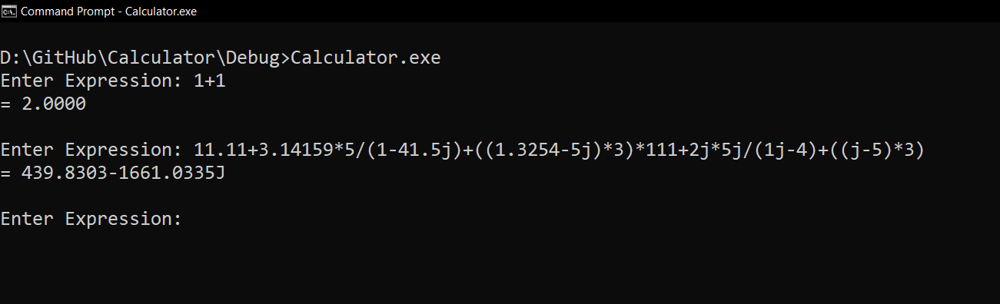
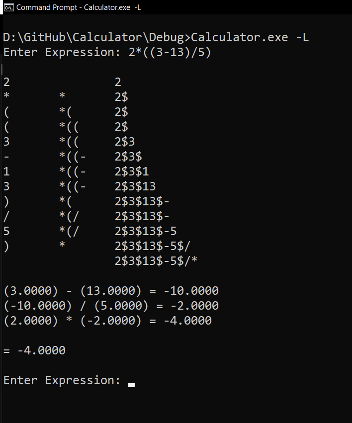

# Complex Calculator
Implementation of Complex Number Calculator using the Shunting Yard Algorithm

## From Terminal
No logging - > Calculator.exe  
logging    - > Calculator.exe -L  

## Output Without Logging

## Output With Logging

## Youtube
Video Link: https://youtu.be/vatTOGvZfZA
